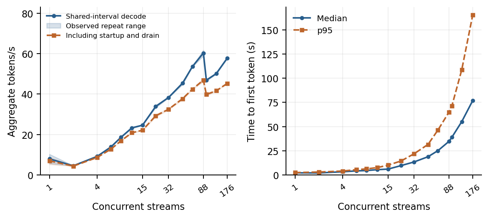
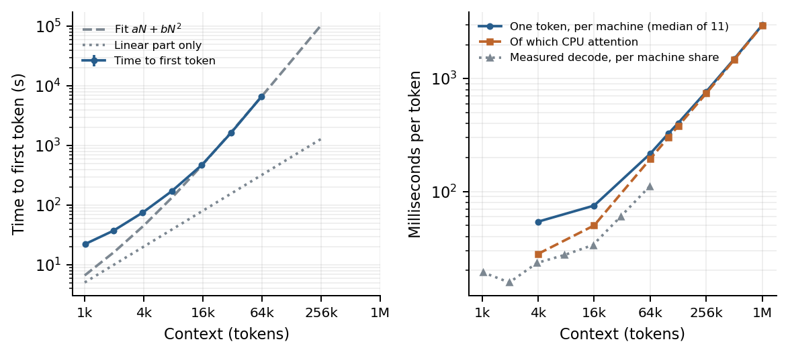

# Cascadia: Resident 975B MoE Inference on Eleven AI PCs

Research manuscript by **Tate Berenbaum**, **Matias Parij** (Not Community Labs Inc.), and **Muthaiah Venkatachalam** (Intel Corporation). Private author-review draft, October 2026.

[Read the paper (PDF)](main.pdf) · [LaTeX source](main.tex) · [Contributions and prior work](research/NOVELTY.md) · [Claim map](reproduction/CLAIMS.md)

## Abstract

Copy the text below into arXiv's Abstract field. It matches the manuscript abstract with generated values expanded and TeX spacing removed (1,866 characters).

```text
Mixture-of-experts models make nearly trillion-parameter capacity accessible with sparse per-token computation, provided that the serving system can distribute the weights and coordinate their execution. We present Cascadia's resident execution of Inkling, a 975B-total/41B-active-parameter model, on eleven Intel Core Ultra X7 358H AI PCs, each with 64 GB of memory, Arc B390 integrated graphics and gigabit Ethernet. We contribute a custom resident MoE engine that preserves Inkling's routing rules, constructs compressed graphs for OpenVINO's fused iGPU primitives, and coordinates FP16 expert computation with FP32 output restoration. The engine fits six consecutive decoder layers per machine and represents dense feed-forward blocks as all-active expert slices, reducing measured dense-layer call time from approximately 8.1 to 4.5 ms. A streaming pipeline coordinates concurrent generation, while captured-state draft evaluation measures agreement with the deployed numerical path. Paired measurements at fifteen concurrency levels from 1 to 176 streams reach 60.29 aggregate decode tokens/s at 88 streams, with 46.87 tokens/s over the complete serving phases. At fifteen streams, median first-token latency is 6.05 s. Raising the context budget from the 1,024-position default, real prompts of 1k to 64k tokens recover the embedded code in all 19 measured answers, with first-token time growing as $aN+bN^2$ and decode latency growing approximately linearly, both bounded by a single-threaded CPU attention loop rather than by memory, which holds 512k positions per stream. Evaluation on captured fleet states separates the effects of vocabulary selection and weight quantization on draft agreement. Together, these contributions establish an execution and evaluation approach for large sparse models on distributed client systems with shared CPU-GPU memory.
```

## Contributions

The paper presents Cascadia's execution of Inkling's 975B text decoder on eleven Intel Core Ultra X7 358H machines, each with nominal 64 GB memory, Arc B390 integrated graphics and gigabit Ethernet. It develops three contributions:

1. **A custom resident MoE engine for shared-memory accelerators.** Cascadia builds Inkling-specific compressed graphs, retains its routing rules in Rust, and manages FP16 expert computation with FP32 output restoration around OpenVINO's fused iGPU primitives. Layer residency and reusable inference requests fit this execution into each machine's shared memory. Dense layers use eight all-active expert slices, reducing measured calls from about **8.1 ms to 4.5 ms**.
2. **A streaming pipeline for concurrent serving.** Per-stream KV/convolution state, balanced admission, eight-row prefill windows and a direct token-return path coordinate generation. Paired measurements from **1 to 176 streams** reach **60.29 aggregate decode tokens/s** and **46.87 whole-phase tokens/s** at **88 streams**, eight per pipeline group. At fifteen streams, median TTFT is **6.05 s**.
3. **Draft evaluation using deployed states.** FP32 residual capture, emitted token IDs and stateful draft replay enable matched-state numerical comparisons. Vocabulary restriction accounts for **2.271 percentage points** of first-draft agreement difference; further quantization at that vocabulary accounts for **0.175 percentage points**.

The contribution is the architecture, implementation and empirical findings of this integrated system. [The prior-work assessment](research/NOVELTY.md) explains how it extends the [Cascadia architecture manuscript](https://github.com/labscommunity/cascadia-architecture-paper), [pipeline-shard paper](https://arxiv.org/abs/2608.19147) and related research. Established algebra and scheduling primitives are credited where used.

## Custom engine contribution

Section 3 explains the exporter, routing interface, resident runtime and numerical range management, with a diagram showing Cascadia's responsibilities and OpenVINO's execution boundary. The engine preserves existing INT4 groups, treats routed and shared experts through one interface, and uses per-layer up-projection attenuation plus per-row routing normalization with FP32 restoration. Dense and sparse blocks share the fused representation.

OpenVINO supplies the compressed MoE primitive and graph lowering. The paper attributes those mechanisms and the prior art for equivalent rescaling and dense-to-expert decomposition; its contribution is the implemented engine and measured results in this deployment. [Implementation anchors](reproduction/CODE_MAP.md) and the [novelty assessment](research/NOVELTY.md) connect that claim to source evidence.

## Speculative decoding scenarios

Section 4.3 illustrates matching proposals, partial agreement and state rewind, then reports the **fused-iGPU engine's performance**. Its full twelve-prompt table includes first/repeated decode rates of **3.55→11.66 tokens/s (3.28×)** for tips, **5.09→14.70 (2.89×)** for explanation and **3.76→8.66 (2.30×)** for table generation. All twelve prompt/output pairs are identical through 128 tokens. Across the serial requests, the ratios are **1.80× decode** and **1.69× whole-phase throughput**. Both passes enable speculation; the contrast includes accumulated history and differing capture settings.

Additional GPU results show **2.03×** code and **2.19×** true/false rate ratios around a phrase-history transfer, and **11.27 tokens/s median / 15.04 fastest** across three finalized explanation requests. The [GPU comparison table](reproduction/results/speculation_gpu.csv), [phrase-transfer data](reproduction/results/speculation_phrase_transfer.csv) and [measurement audit](reproduction/AUDIT.md#speculative-decoding-scenarios-and-comparisons) document the scope of each result. Earlier CPU-expert on/off checks remain supporting evidence.

## Finalized performance measurements

The fixed-binary survey measures fifteen concurrency levels twice, using twelve prompt families and 128 output tokens per request. Selected operating points:

| Concurrent streams | Aggregate decode tokens/s | Whole-phase tokens/s | Median TTFT | p95 TTFT |
|---:|---:|---:|---:|---:|
| 1 | 7.96 | 6.98 | 2.18 s | 2.41 s |
| 15 | 24.60 | 22.12 | 6.05 s | 10.11 s |
| 32 | 38.31 | 32.48 | 13.44 s | 21.90 s |
| 64 | 53.60 | 42.41 | 25.10 s | 46.41 s |
| 88 | 60.29 | 46.87 | 34.61 s | 64.75 s |
| 128 | 50.10 | 41.61 | 55.11 s | 108.73 s |
| 176 | 57.72 | 45.24 | 76.83 s | 165.34 s |

Decode throughput counts tokens over intervals when every request in a cohort is decoding; whole-phase throughput includes admission, prefill, queueing and drain. Rates average two phases; latency quantiles pool their requests. Phrase learning remains active across repeated prompts, and the [measurement protocol](reproduction/AUDIT.md) records ordering and capture state. The highest paired mean on the measured grid occurs at 88 streams.



The [full curve](reproduction/results/concurrency.csv) and [raw-event reconstruction](reproduction/results/survey_audit.json) accompany the paper. The complete survey comprises **33 measured phases, 1,592 requests and 203,776 output tokens**, with two additional pilot records preserved separately. Earlier windowed-admission measurements support the configuration analysis.

## Context length

The serving configuration holds 1,024 sequence positions per stream. With the budget raised to $2^{20}$, a probe on every machine measured the memory and per-token cost of contexts from 4k to 1M, and real prompts of 1k to 64k tokens with a code sentence near the start and a question about it at the end were served one at a time (three repeats up to 16k, two to 64k; 96 output tokens). The code was found in all 19 answers.

| Context (tokens) | First token | Prefill tokens/s | Decode tokens/s | Busy CPU cores per machine | iGPU busy |
|---:|---:|---:|---:|---:|---:|
| 1,041 | 22 s | 46.4 | 4.73 | 0.97 | 56 % |
| 3,991 | 75 s | 52.9 | 3.91 | 1.00 | 44 % |
| 15,897 | 7.8 min | 33.8 | 2.71 | 1.02 | 26 % |
| 31,614 | 27.2 min | 19.3 | 1.51 | 1.00 | 16 % |
| 64,292 | 109.7 min | 9.8 | 0.82 | 1.00 | 9 % |
| 131,072 | not within the 6 h request cap | — | — | | |

First-token time fits $N/202 + 1.51\times10^{-6}N^2$ seconds; the quadratic part is the CPU attention over the growing context during prefill, executed at about 11 GFLOPS per machine, and the decode cost grows by 2.8 ms per thousand positions per machine for the same reason. Both are the throughput of one core: every machine had one CPU core busy during every request. The probe admits 512k positions per stream on every machine with its 3 GiB reserve. At 1M, the cache needs 8.0 GiB per machine and only rank 0 satisfies that reserve. The [context table](reproduction/results/context.csv), the [probe](reproduction/results/context_probe.csv) and the source records ([034](reproduction/evidence/source/autolab/experiments/034_context_scan/verdict.md), [047](reproduction/evidence/source/autolab/experiments/047_context_stress/verdict.md)) accompany the paper.



## Build and data

The included evidence supports offline reconstruction of the reported measurements:

```sh
make data       # Reconstruct tables with Python 3.10+ standard library
make figures    # Generate paper charts with pinned Matplotlib through uv
make            # Build the PDF with Tectonic or pdfLaTeX + BibTeX
make verify     # Check evidence, metrics, citations and report links
```

The [evidence snapshot](reproduction/evidence/manifest.json) covers 52 source experiment directories, 160 phase records, 35 fleet telemetry archives, 36 request/stat archives and 440 hashed evidence files. [Measurement documentation](reproduction/README.md) describes the reconstruction; [CLAIMS.md](reproduction/CLAIMS.md) connects each paper contribution to its records. The preserved source archive supplies provenance independently of the paper's contribution-based organization.

## Supporting material

- [Hardware and capability](reproduction/HARDWARE.md)
- [Runtime architecture and code anchors](reproduction/CODE_MAP.md)
- [Metric and evidence audit](reproduction/AUDIT.md)
- [Annotated primary sources](research/RELATED_WORK.md) and [search scope](research/SEARCH_SCOPE.md)
- [Derived result tables](reproduction/results/) and [validation record](reproduction/VALIDATION.md)

## Authors

- Tate Berenbaum — Not Community Labs Inc.
- Matias Parij — Not Community Labs Inc.
- Muthaiah Venkatachalam — Intel Corporation

For arXiv's Authors field, use full names in manuscript order with affiliations in parentheses:

```text
Tate Berenbaum (Not Community Labs Inc.), Matias Parij (Not Community Labs Inc.), Muthaiah Venkatachalam (Intel Corporation)
```

See [arXiv's metadata formatting instructions](https://info.arxiv.org/help/prep.html) for author and abstract requirements.
